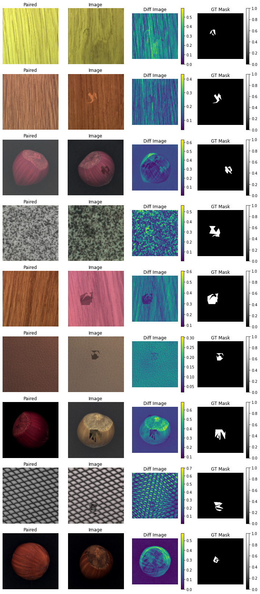

UNDER CONSTRUCTION

.. figure:: skself/assets/images/logo.png
   :align: center
   :alt:
   :scale: 50 %

.. image:: https://readthedocs.org/projects/skself/badge/?version=latest
    :target: https://tfds-defect-detection.readthedocs.io/en/latest/README.html
    :alt: Documentation Status
.. image:: https://img.shields.io/pypi/v/skself
   :target: https://pypi.org/project/tfds-defect-detection/
.. image:: https://img.shields.io/pypi/pyversions/skself
   :alt: PyPI - Python Version

========================================
Self-supervised learning sklearn-style
========================================

To directly jump into the code look at the sample notebook

.. class:: center

|Open in Colab|

.. |Open in Colab| image:: https://img.shields.io/badge/Open%20In-Colab-orange?style=for-the-badge&logo=data:image/png;base64,iVBORw0KGgoAAAANSUhEUgAAAB4AAAAUCAYAAACaq43EAAAACXBIWXMAAAdiAAAHYgE4epnbAAAEg2lUWHRYTUw6Y29tLmFkb2JlLnhtcAAAAAAAPD94cGFja2V0IGJlZ2luPSfvu78nIGlkPSdXNU0wTXBDZWhpSHpyZVN6TlRjemtjOWQnPz4KPHg6eG1wbWV0YSB4bWxuczp4PSdhZG9iZTpuczptZXRhLyc+CjxyZGY6UkRGIHhtbG5zOnJkZj0naHR0cDovL3d3dy53My5vcmcvMTk5OS8wMi8yMi1yZGYtc3ludGF4LW5zIyc+CgogPHJkZjpEZXNjcmlwdGlvbiByZGY6YWJvdXQ9JycKICB4bWxuczpBdHRyaWI9J2h0dHA6Ly9ucy5hdHRyaWJ1dGlvbi5jb20vYWRzLzEuMC8nPgogIDxBdHRyaWI6QWRzPgogICA8cmRmOlNlcT4KICAgIDxyZGY6bGkgcmRmOnBhcnNlVHlwZT0nUmVzb3VyY2UnPgogICAgIDxBdHRyaWI6Q3JlYXRlZD4yMDIyLTExLTA4PC9BdHRyaWI6Q3JlYXRlZD4KICAgICA8QXR0cmliOkV4dElkPjdiZTBlMWY0LTU3YTUtNDBhMi05ZjIzLTM2N2Q1YzU1OGYyNjwvQXR0cmliOkV4dElkPgogICAgIDxBdHRyaWI6RmJJZD41MjUyNjU5MTQxNzk1ODA8L0F0dHJpYjpGYklkPgogICAgIDxBdHRyaWI6VG91Y2hUeXBlPjI8L0F0dHJpYjpUb3VjaFR5cGU+CiAgICA8L3JkZjpsaT4KICAgPC9yZGY6U2VxPgogIDwvQXR0cmliOkFkcz4KIDwvcmRmOkRlc2NyaXB0aW9uPgoKIDxyZGY6RGVzY3JpcHRpb24gcmRmOmFib3V0PScnCiAgeG1sbnM6ZGM9J2h0dHA6Ly9wdXJsLm9yZy9kYy9lbGVtZW50cy8xLjEvJz4KICA8ZGM6dGl0bGU+CiAgIDxyZGY6QWx0PgogICAgPHJkZjpsaSB4bWw6bGFuZz0neC1kZWZhdWx0Jz5PUEVOIElOIENPTEFCICgxMDAgw5cgMTAwIHB4KSAtIDE8L3JkZjpsaT4KICAgPC9yZGY6QWx0PgogIDwvZGM6dGl0bGU+CiA8L3JkZjpEZXNjcmlwdGlvbj4KCiA8cmRmOkRlc2NyaXB0aW9uIHJkZjphYm91dD0nJwogIHhtbG5zOnBkZj0naHR0cDovL25zLmFkb2JlLmNvbS9wZGYvMS4zLyc+CiAgPHBkZjpBdXRob3I+VG9iaWFzIFNjaGllbGU8L3BkZjpBdXRob3I+CiA8L3JkZjpEZXNjcmlwdGlvbj4KCiA8cmRmOkRlc2NyaXB0aW9uIHJkZjphYm91dD0nJwogIHhtbG5zOnhtcD0naHR0cDovL25zLmFkb2JlLmNvbS94YXAvMS4wLyc+CiAgPHhtcDpDcmVhdG9yVG9vbD5DYW52YTwveG1wOkNyZWF0b3JUb29sPgogPC9yZGY6RGVzY3JpcHRpb24+CjwvcmRmOlJERj4KPC94OnhtcG1ldGE+Cjw/eHBhY2tldCBlbmQ9J3InPz5sF+fkAAAFSElEQVRIiV2Va4heRx3Gf8/MOe9599I2u61dNyaCTc02NZUi1iimrRb9oFCptShVqYgXFIsaEEP9UIt+EUHwgmCiVjGIFupKEBsbQWKlWKL9oCRNixhtYtKtYbPp3vK+7zkzjx/O2aZmDsMwM//L/C/Pc/TXH8BN0xAAIqREiBE3DVYAzKWRgUB7KkwG1H2ZjPj/YQgFygmtrJOvnoAa6BmKG4pAumhG66KczgHIna8tmDcDrwIScAo4CizbEAIYIiYhjJlG7AK2AALOAUdtzgCe7BNWX4w5TmRGIxGa5UBal9742QeIY2TE23LioMQJ4NfAfuDHwO8JPAd8B3jtaBkQSeJ1mB92d4918vuAecQJZ+aBW+I4+dkvz5CGIq0FtPy9QLk5s/DzK9n8keWHnPiqLqUsdVNtIQhu0/FPNnE9F7gH+Akw2elkoOl0YzexQQUPnDs08Y3R0T7XfGaJuPc9hQb/LolXpG8Wk/krxQR2ppEwUNhEQUQIGAAF8C0GTAHzEj2JUdcN0W4dSgSgsUmhJNaL4V3NSlC1fXQEK2jhi30MH8R6RIXrK3YOc3GVK7fvXgD+AVTAjcAk8AzwceAPEhM2jUS0EbAMHOuingNmVEC9pPXVY/3SmRL5fcBvgoZNBfqaArgJWjleVfWSahXsTeuaqxe47dl1dtnsBA4CDwGfAiaA+hVO92N2hB5vr3Zwe1rXDSp4sF4Mo9XjVc9ZUgDQ1z1IUS98oX830q9ASbKcCeD7qtl0YOpjNTwPC6dhUwsllLkOcUxirEtlgfk2kT0kUIDekR58fsTSfMnwhfhppH0KZCwbR+z3BsRtABKNTUAcDkU4UE07rB2SRqdgyiBRqm2sW6F12tX7DOZBN0AbPcN3jlh7QmFiLkll3I/8x852W0Dp1gB6w2Ww/12qzcpzZehtxvWqUGu0TajY3sk1Hd6PqGAlRIJNAqgXA3Gb89KTvZibDNbhl6233X9TAMa7TeiuVhSMEz5/aJLVv/c2VDY4LL68b0/W7BYyQeARrJ8oOf1wgZNoYeb1y4IbC8DpzkBqzfnGtB4pp1KY2bvCNXcMsdkgSTAvdcobD91ebYGlp/qECv780WsJWVw1N3YpPrHtsseeCdhPbxiSBNKHB2d0bRjL9dpjoWwGBMqWPDq5P3VrqZYq31H/l9vHXtPk5WNlb8ee5VgHQl5seti1nGdB93ahd9ny0UBLczXQAxKZmendwwNTn2wmq1fnmpaNEjDquPscLZaDTVIJo3Nh/8rx3s7BmXJEVgKy8Mj2Jku/AK5W24wlcBH7cPzS7vIcZpvEzblW059t6vHX13PpJB/yiB5iCtgJfALxU4QwjwJ3qSDXS7q4eqKaDSX3qfAUYkLmeqT3S/oR6GapfYztCH6YEH6ms/f3CaVnnMNfqplm68RcPSS3VHlZQyC1TWSzO0T21Bf0gdVnqjWnMKbgDR6/JN8qNZ3THnAS51tA54tqNkU3ehE1d45fVz9OZsYmSwy59HNwl24DfYnv9qa5Y+mpasZJuxXA1miD3zu/qVsL2wXwH+w7kc4DIYzOxxT6jqHvv6ngLc4c7OpX2fQ6xwXtvg+sYh5f/G310uBkfDfy920ncA9cYUfsaLvXzQCed867ut6ISLnITSCO1ykPFBU55cxdtOx0N/Amm5mu+Z7HPAn80vCvxeN9gjzoh3x/Tt4nca+ttwJbOwQsgJ/GPErQE13eQ5sJocEjrywIQcLu0FaXUAzpYRwK6g7PWIT+PeSznxtTHEM5OUtCV06QLqxUAJwdjuLWMdsGBZEzpiVdkfkfodOPwQgKJiAAAAAASUVORK5CYII=
   :target: https://colab.research.google.com/drive/1KGR3EeF6eV-dgO07DZ_NCqSgrAJbzhCs?usp=sharing

.. admonition:: Features

    - TBD

Provides a Model inheriting sklearn.base.BaseEstimator  for
-----------------------------------------------------------------

+--------+-------+-----+
| Method | Paper | API |
+========+=======+=====+
| ...    | ...   | ... |
+--------+-------+-----+

Install
-------

Create a new python=3.9 env and install `skself` from pip

.. code-block:: bash

    pip install skself

Examples
-----------

.. code-block:: python

    import skself
    ... TBD

Usage
-----------

All parmeters

.. code-block:: python

    import skself
    ... TBD

Docs
----

FOR API Reference see

https://sklef.readthedocs.io/en/latest/autoapi/skself/index.html

Cite
----

If this project helped you during your work:
Until a publication is available, please cite as

Tobias Schiele et al. (2023). skself - Self-supervised learning sklearn-style. https://github.com/thetoby9944/skself.

.. code-block:: latex

   @misc{Schiele2019,
       author = {Tobias Schiele, Daria Kern, Prof. Dr. Ulrich Klauck},
       title = {Skself - Self-supervised learning sklearn-style},
       year = {2022},
       publisher = {GitHub},
       journal = {GitHub repository},
       howpublished = {\url{https://github.com/thetoby9944/skself}},
   }

